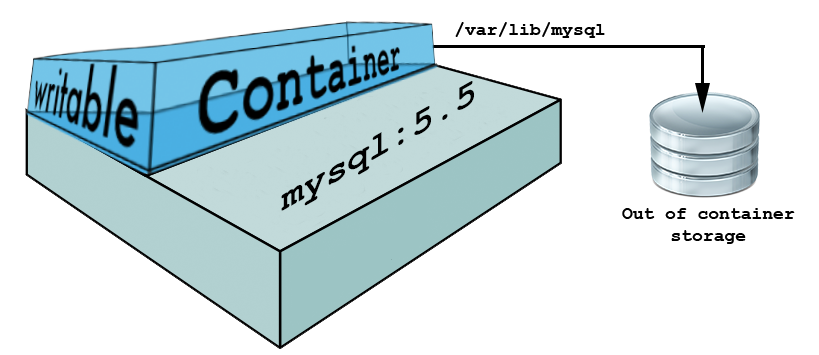
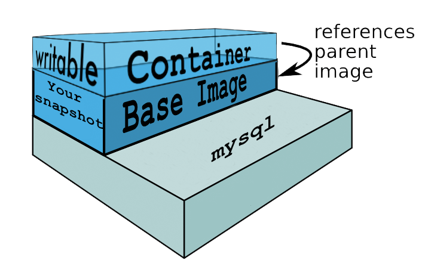

# DB sandbox mode

!!! warning "This documentation is outdated"
    Instructions in this document need to be updated

In certain cases, you may want to have a DB sandbox and mess around with the DB, then roll it back.
Normally, this can be achieved by backing up the DB and restoring it from the created DB dump.
With large databases (over 500MB), this operation can take a considerable amount of time (10+ minutes).

With Docker, we can sandbox the DB by creating a reusable docker image from the DB container.
Spinning up such image takes less time than re-importing the DB with MySQL.

For example, a 2.6GB DB dump file takes 14 minutes to import with MySQL. (Re)launching a docker container from an image with that same imported dump takes only 2 minutes. **Your results may obviously vary.**

This is an advanced used case, so make sure you have a backup of the database before proceeding.
To get started, follow instructions below:

## How it works

In Docker terminology, a read-only [Layer](https://docs.docker.com/terms/layer/#layer) is called an image. In a traditional setup you would use the stock [mysql image](https://registry.hub.docker.com/_/mysql/) as the base image for your DB container.

:page_facing_up: docksal.yml
```yml
# DB node
db:
  image: mysql:5.5
  ...
  ```

The image never changes. Thanks to the [Union File System](https://docs.docker.com/terms/layer/#union-file-system), when a process wants to write a file to an image, Docker creates a copy of that file in a new layer (the top-most writeable layer).

The stock [mysql image](https://registry.hub.docker.com/_/mysql/) defines a data volume (`/var/lib/mysql`). This makes sure the DB data is permanently stored outside of the `db` container on the host and is not lost as the container is (re)launched.



To make the sandbox DB mode possible, we have to remove this permanent storage volume from the image (this is done using a fork of the image), import the DB and commit the container as a new image with the `docker commit` command.
The new image will include the base image plus all in-memory changes made (i.e. your DB snapshot). It is then used as the base image for the DB node going forward.

:page_facing_up: docksal.yml
```yml
# DB node
db:
  image: mysql_with_my_database:snapshot1
  ...
  ```



Now you can perform any changes to the database you want and each time after the container is restarted all changes will be lost (as it doesn't have external persistent storage) and you will be back to your base image `mysql_with_my_database:snapshot1`.

## Steps

1. Create a DB dump.
2. Add '-sandbox' to the image version for the **db** service base in `docksal.yml` (example: docksal/mysql:5.5 => docksal/mysql:5.5-sandbox).
3. Reset containers.

    `fin reset`

4. Import the DB dump you created in step 1.
5. Stop and [commit](https://docs.docker.com/reference/commandline/cli/#commit) the **db** service container (this will turn the container into a reusable docker image).

    `fin stop db && docker commit $(fin docker-compose ps -q db) <tag>`

    Replace `<tag>` with any meaningful tag you'd like to use for the image. E.g. `db_backup` or `dbdata/myproject:snapshot1`.

6. Replace the *db* service base image in `docksal.yml` with the selected tag. E.g. `image: dbdata/myproject:snapshot1`.
8. Restart containers.

    `fin up`

You will now have a sandboxed DB container which defaults to the DB snapshot you created in step 1 every time the db container is restarted.

## Precaution

In case you have a large database, it is not recommended to commit the container that already runs on the snaphot Base Image (i.e. creating snapshot on top of snapshot). Every docker image holds all parent images plus in-memory changes inside it. Thus **with every commit the size of the resulting image will increase by full size of the DB, not its delta.**

In case of small database, though, it is ok to do that. But please keep in mind there's a limitation on the depth of layers which currently equals 120.

## Disabling the sandbox mode

You will need a DB dump to revert.
Either use the one created before enabling the sandbox mode or take another one while the **db** service contained is still up.

1. Revert the changes done to the **db** service in `docksal.yml`.
2. Reset containers.

    `fin reset`

5. Import the DB dump.

Now the **db** service container is using a persistent data storage volume `/var/lib/mysql`.
