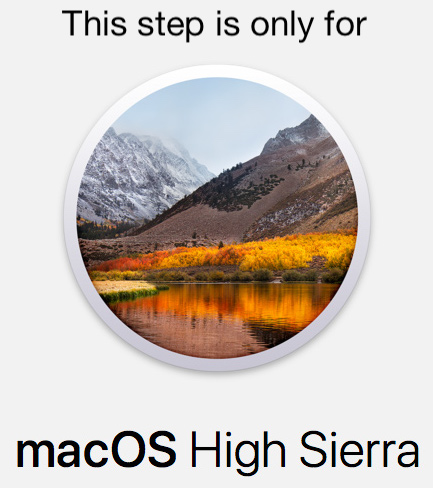

# Docksal setup

!!! tip "This is a one time setup"
    Once you have a working Docksal environment in place, you can use it for all Docksal powered projects.

Installing Docksal on

- [Windows](#windows)
- [macOS](#macos)
- [Ubuntu Linux](#linux)

<a name="windows"></a>
## Installing Docksal on Windows

### 1. Install Babun

Install [Babun](http://babun.github.io/) and run all further commands in Babun.

!!! danger "Install as a regular user"
    Babun should be installed and run **as a regular user** (do **NOT** run as Administrator to install).

Docksal is not tested and does not support other Linux-type shells on Windows.

### 2. Install Docksal

```bash
curl -fsSL https://get.docksal.io | sh
```

### 3. Create and start the vm

```bash
fin vm start
```
[Help, my VM did not start!](../troubleshooting.md#failed-creating-docksal-virtual-machine)

### 4. Congratulations!

You are done with the one time environment installation. Now you can [configure your project](../getting-started/project-setup.md) to use Docksal or create a new pre-configured Drupal or Wordpress project with `fin project create`.

!!! info "Experimental support for Native Docker applications"
    Advanced Docker users may want to check out how to use Docksal with [Native Docker applications](../getting-started/env-setup-native.md).

<a name="macos"></a>
## Installing Docksal on macOS

### 1. Install VirtualBox and allow kernel extension (macOS High Sierra only)



1.1. [Install VirtualBox 5.1.28](http://download.virtualbox.org/virtualbox/5.1.28/VirtualBox-5.1.28-117968-OSX.dmg) manually

1.2. Approve VirtualBox'es kernel extension ([Why?](https://developer.apple.com/library/content/technotes/tn2459/_index.html))


### 2. Install Docksal

```bash
curl -fsSL https://get.docksal.io | sh
```

### 3. Create and start the vm

```bash
fin vm start
```
[Help, my VM did not start!](../troubleshooting.md#failed-creating-docksal-virtual-machine)

### 3. Congratulations!

You are done with the one time environment installation. Now you can [configure your project](../getting-started/project-setup.md) to use Docksal or create a new pre-configured Drupal or Wordpress project with `fin project create`.

!!! info "Experimental support for Native Docker applications"
    Advanced Docker users may want to check out how to use Docksal with [Native Docker applications](../getting-started/env-setup-native.md).

<a name="linux"></a>
## Installing Docksal on Ubuntu Linux

### 1. Avoid conflict with Apache

By default Apache listens on `0.0.0.0:80` and `0.0.0.0:443`. This will prevent Docksal from running properly.

You either need to stop Apache or reconfigure it to listen on different ports (e.g., `8080` and `4433`) or different host (e.g., `127.0.0.1:80` and `127.0.0.1:443`).

### 2. Install Docksal

```bash
curl -fsSL https://get.docksal.io | sh
```

### 3. Congratulations!

You are done with the one time environment installation. Now you can [configure your project](project-setup.md) to use Docksal or create a new pre-configured Drupal or Wordpress project with `fin project create`.
