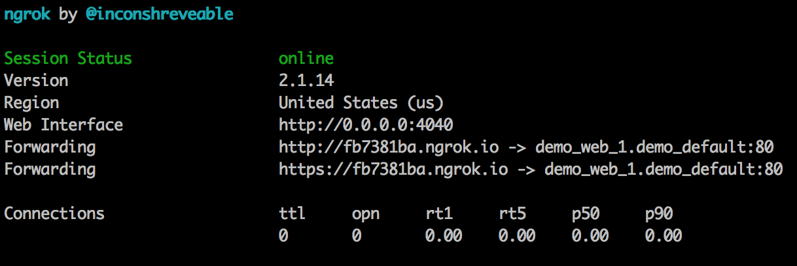

# Public Access

In certain cases you may need to share or expose you local web server on the internet.
E.g. share access with a teammate or customer to demonstrate the work or discuss the progress.
Working with external web services that expect a callback URL is also generally not possible with a local environment.

## Welcome to ngrok!

ngrok creates a tunnel from the public internet **http://subdomain.ngrok.com** to a port on your local machine.
You can give auto-generated URL to anyone to allow them to try out a web site you're developing. ngrock also allows you to debug network requests made to your site.

## How to use

Inside project folder run:

    fin share

To stop sharing use `Ctrl+C`

You will see clie interface provided by running ngrok container. Use web address shown there to share.

