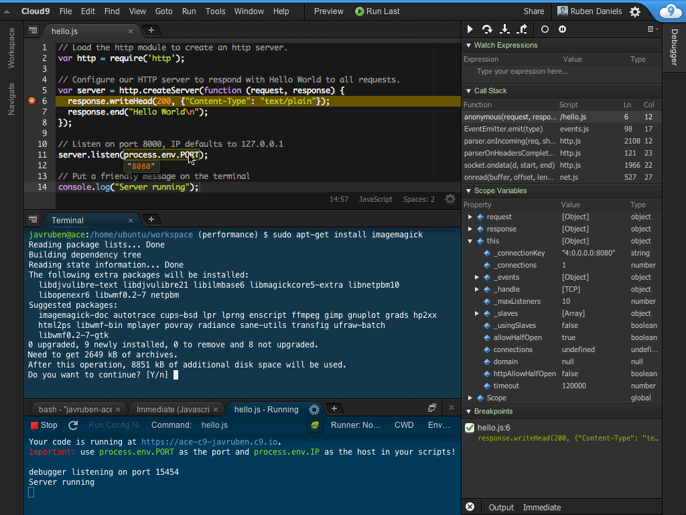

# Cloud9 IDE

Cloud9 is an open source, web based, IDE (integrated development environment) that allows for a developer to make changes
to code without working from their desktop or needing additional tools.



## Enabling Cloud9

### Set the `IDE_ENABLED` variable for the project.

Enable IDE for the project by setting the `IDE_ENABLED` variable.

```bash
fin config set --env=local IDE_ENABLED 1
```

!!! tip "For Other Developers on the Project"
	To enable for other developers within the project remove the `--env=local` option from the above command.

Then restart the project

```bash
fin project restart
```

## Accessing IDE

After enabling the IDE can be accessed at `ide.PROJECT_NAME.docksal`.


!!! note "Configuration confinements"
	Since vhost-proxy does not support routing more than a single custom port, IDE mode cannot be used in conjunction
	with the nodejs stack (stack-node.yml).


!!! tip "Testing before committing"
	To test the Cloud9 IDE before adding it to your project [click here](http://c9.github.io/core/).