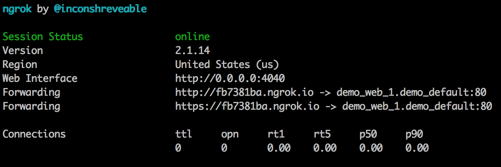

# Public Access via ngrok

In certain cases you may want to share or expose you local web server on the internet.
E.g. share access with a teammate or customer to demonstrate the work or discuss the progress.
Working with external web services that expect a callback URL is also generally not possible with a local environment.

## ngrok

[ngrok](https://ngrok.com/) creates a tunnel from the public internet `http://<subdomain>.ngrok.io` to a port on your local machine.
You can share the auto-generated URL with anyone to give them access to your local development environment. 
ngrok also has a web UI with an inspector for the HTTP traffic flowing over the tunnel.

## Usage

Inside the project folder run:

```bash
fin share
```

You will see a console output from the `ngrok` container.  
Use `*.ngrok.io` web address displayed there to share you project with others:



Use `Ctrl+C` to stop ngrok and sharing.

To access ngrok web UI, open another console window and run

```bash
fin docker ps --format "{{.Names}} {{.Ports}}" | grep ngrok
```

In the output, look for the port number assigned to the container:

```bash
$ fin docker ps --format "{{.Names}} {{.Ports}}" | grep ngrok

project_web_1_ngrok 0.0.0.0:32769->4040/tcp
``` 

Access ngrok web UI at `http://192.168.64.100:32769`


## Overriding default host value

The default `HOST` header value (passed to the web container) can be overridden using `--host` option.   
This can be useful to share a specific site in a Drupal multi-site project.

```bash
fin share --host=example.com
``` 

## Additional ngrok Configuration

Additionally, you can specify one of several environment variables to configure your ngrok tunnel. These can be configured either in `$HOME/.dockal/docksal.env` or at the project level within `.docksal/docksal.env`. Due to the nature and sensitivity of these variables, they should be configured within `.docksal/docksal-local.env` and not committed to the repository.

Variable | Purpose
---------|--------
NGROK_AUTH | Authentication key for your ngrok account. This is needed for custom subdomains, custom domains, and HTTP authentication.
NGROK_SUBDOMAIN | Name of the custom subdomain to use for your tunnel. You must also provide the authentication token.
NGROK_HOSTNAME | Paying ngrok customers can specify a custom domain. Only one subdomain or domain can be specified, with the domain taking priority.
NGROK_USERNAME | Username to use for HTTP authentication on the tunnel. You must also specify an authentication token.
NGROK_PASSWORD | Password to use for HTTP authentication on the tunnel. You must also specify an authentication token.
NGROK_PROTOCOL | Can either be `HTTP` or `TCP`, and it defaults to `HTTP` if not specified. If set to `TCP`, ngrok will allocate a port instead of a subdomain and proxy TCP requests directly to your application.
NGROK_PORT | Port to expose (defaults to `80` for `HTTP` protocol).
NGROK_REGION | Location of the ngrok tunnel server; can be `us` (United States, default), `eu` (Europe), `ap` (Asia/Pacific) or `au` (Australia)
NGROK_DEBUG | To debug the connection and see a more detailed log set this to 1
NGROK_HEADER | Set Host Header. Set to the domain that should be passed through to the host.
