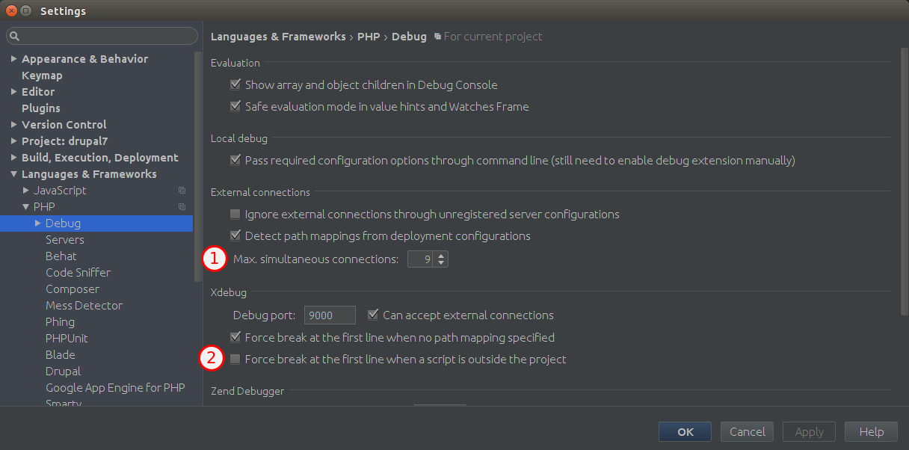
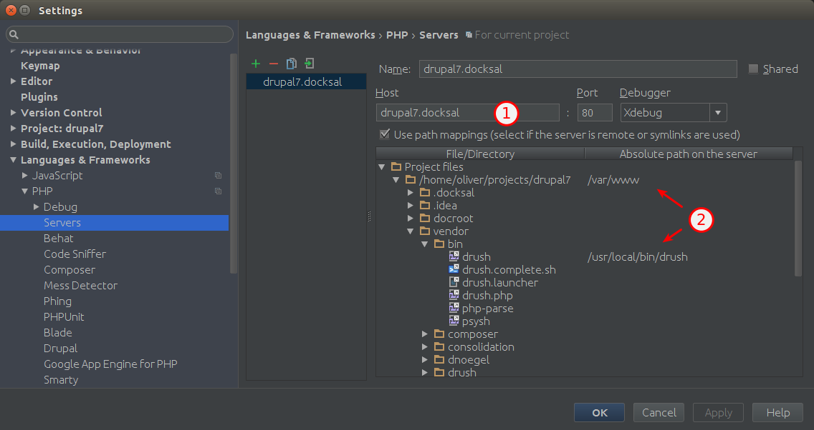

# Debugging with Docksal, Xdebug and PhpStorm

`xdebug` extension is disabled by default as it causes about 20% performance hit.

There are two ways of using xdebug, for debugging requests from browser or for debugging cli scripts (for example Drush commands).

To configure debugging in browser follow **Prerequisites** and **Setup**.

To configure debugging of cli scripts follow **Setup for console php**.

## Prerequisites

- [PHPStorm](https://www.jetbrains.com/phpstorm/)
- [Xdebug Helper](https://chrome.google.com/extensions/detail/eadndfjplgieldjbigjakmdgkmoaaaoc) extension for Chrome

You can also pick from the [list](https://confluence.jetbrains.com/display/PhpStorm/Browser+Debugging+Extensions) of options for other browsers.

## Setup

1) Set environment variable on the `cli` in `.docksal/docksal.env`

```bash
XDEBUG_ENABLED=1
```

2) Update container configuration with `fin up`  

3) Open your project in PHPStorm  

4) Set a breakpoint wherever you like  

5) Click on the **Start Listening for PHP Debug Connections** button in PHPStorm


6) Click on **Debug** in **Xdebug Helper** in Chrome


7) Click on **Accept** in the **Incoming Connection From Xdebug** dialogue in PHPStorm


## Setup for console php

For debugging simple cli php-scripts only steps 1) and 2) are required.

1) Set environment variable on the `cli` service through creating/editing `./docksal/docksal-local.yml`

```yaml
version: "2.1"
services:
  cli:
    environment:
      - XDEBUG_ENABLED=1
      - XDEBUG_CONFIG=idekey=PHPSTORM remote_host=192.168.64.1
      - PHP_IDE_CONFIG=serverName=${VIRTUAL_HOST}
```

2) Update container configuration with `fin up`

3) Configure PHPStorm to be able to handle drush debugging


- (1) You need to increase the Max. simultaneous connections to allow drush to spawn other drush instances. Otherwise the debugger might get stuck without any response.
- (2) Disable "Force break at the first line when a script is outside the project". As the main drush binary resides in `cli` in `/usr/local/bin/drush` the debugger will break on every drush invocation.

4) Install a site specific drush in your project root (if not already done) to get a non-phar version of drush.

```bash
fin exec composer require drush/drush:8.x
```

5) Set path mappings for drush in PHP-Storm (note that `vendor` folder is inside `docroot` in Drupal 8):


- (1) Enter the same hostname as you did in `VIRTUAL_HOST` and `PHP_IDE_CONFIG` environment variables before.
- (2) Map your docksal project root to `/var/www` so your all your files are mapped. Additionally map your site drush to `/usr/local/bin/drush`.

6) You can run your scripts in console and debug them in the same way as browser requests.

For example you can run drush command: `fin drush fra -y` and debug this drush command from feature module.

### Resources

- [Zero-configuration Web Application Debugging with Xdebug and PhpStorm](https://confluence.jetbrains.com/display/PhpStorm/Zero-configuration+Web+Application+Debugging+with+Xdebug+and+PhpStorm)

# Debugging with Docksal, Xdebug and NetBeans IDE

`xdebug` extension is disabled by default as it causes about 20% performance hit.

To configure debugging in browser follow **Prerequisites** and **Setup**.

## Prerequisites

- [NetBeans](https://netbeans.org/downloads/)

## Setup

1) Set environment variable on the `cli` in `.docksal/docksal.env`

```bash
XDEBUG_ENABLED=1
```

2) Update container configuration with `fin up`  

3) Open NetBeans Debugging configuration (follow menu "Tools" -> "Options" -> "PHP" -> "Debugging") and set "DebuggerPort" to 9000

4) Open your project in NetBeans.

5) Configure project properties:

* Click right mouse button at project name and hit "Properties" in the dropdown menu

* In "Sources" category set correct Web Root folder by clicking "Browse" button (usually it's docroot)

* In the "Run Configuration" category select your docksal Project URL (your http://local-site.docksal (replace local-site by your value of SITE_DOMAIN, set via docksal.env file)

* Click "OK" to save project properties.

6) Set a breakpoint wherever you like  

7) When you are in the NetBeans, and your whole project is selected, or one of the project files is opened and active, press **\<CTRL\> + \<F5\>** on your keyboard to run xdebug.
