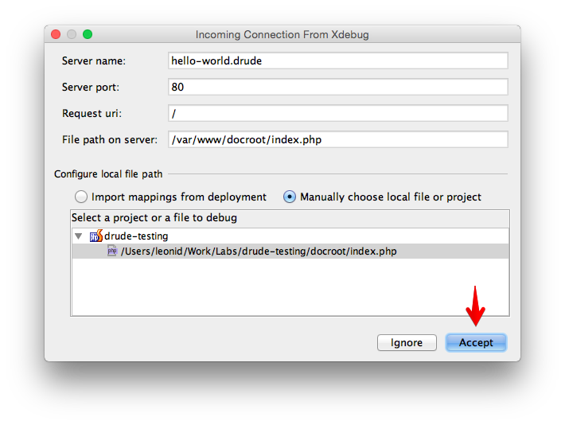

# Debugging with Drude, Xdebug and PhpStorm

`xdebug` extension is disabled by default as it causes about 20% performance hit.

## Prerequisites

- [PHPStorm](https://www.jetbrains.com/phpstorm/)
- [Xdebug Helper](https://chrome.google.com/extensions/detail/eadndfjplgieldjbigjakmdgkmoaaaoc) extension for Chrome

    You can also pick from the [list](https://confluence.jetbrains.com/display/PhpStorm/Browser+Debugging+Extensions) of options for other browsers

## Setup

1. Set environment variable on the `cli` service

    ```yml
    cli:
      ...
      environment:
        - XDEBUG_ENABLED=1
      ...
    ```
2. Update container configuration with `dsh up`
3. Open your project in PHPStorm
4. Set a breakpoint wherever you like
5. Click on the **Start Listening for PHP Debug Connections** button in PHPStorm

    

6. Click on **Debug** in **Xdebug Helper** in Chrome

    

7. Click on **Accept** in the **Incoming Connection From Xdebug** dialogue in PHPStorm

    

Happy debugging!

### Resources

- [Zero-configuration Web Application Debugging with Xdebug and PhpStorm](https://confluence.jetbrains.com/display/PhpStorm/Zero-configuration+Web+Application+Debugging+with+Xdebug+and+PhpStorm)
